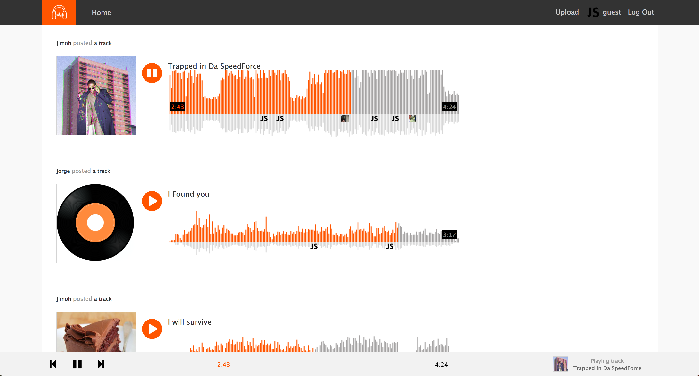

# BeatWave

BeatWave is a social music streaming web application inspired by SoundCloud built on a Ruby on Rails backend and a React/Redux front-end.

[Live version](http://www.beatwave.stream)





## Features and Implementation

### Track CRUD

BeatWave's core functionality revolves the CRUD (Create, Read, Update, Destroy) cycle for tracks. It depends on a RESTful JSON API to structure all aspects of this process. The application's collection is created through track uploads by users. Track uploads are stored in an Amazon Web Services S3 bucket to ensure that large audio files are only passed from client to server once. As a result, playing and deletion depend only on the url corresponding to a particular track. Duration and waveform metadata are also read and stored in the tracks table on upload.

### Queue

The track queue is another centerpiece of BeatWave's functionality. The queue is generated through variable GET requests that accord with the current route. For instance, the Stream home page fetches a randomly generated queue of other users' uploads while a user's profile page shows tracks they uploaded, and a track's profile page creates a single-item queue.

```ruby
def index
  if params[:type] == "stream"
    if current_user
      @tracks = Track.where.not({user_id: current_user.id}).includes(:comments)
    else
      @tracks = Track.all.includes(:comments)
    end
  elsif params[:type] == "user-show"
    id = params[:id].to_i
    @tracks = Track.all.includes(:comments).where(user_id: id)
  end
  render :index
end
```

### Progress Bar

BeatWave uses a progress bar component to handle the queue-related U/I and state updates. The progress bar reads from the current track slice of state that is passed down to it as props. It is responsible for displaying current track information, as well as handling track skips, rewinds, and time seeking. It manages this by dispatching periodic Redux store updates that ensure the HTML audio tag's current time is always stored globally. This allows Waveform and Play/Pause components to always stay in sync with the track progress. It also ensures that re-renders of audio-related components are triggered whenever necessary.

If a user skips to the next track, rewinds to the previous track, or the elapsed time reaches a track's duration, the progress bar dispatches a Redux store update, setting the current track accordingly. If the current track reaches the end of the queue, the current track is reset to the first track.

### Continuous play

BeatWave optimizes user experience by ensuring that the current track is never disrupted by unrelated user interactions. It achieves this by storing HTML audio tags in the progress bar and rendering this component globally. Once the queue is initiated, the progress bar operates independently of navigations to other routes, track uploads, or commenting. Only track changes or time seeking affect the internal logic of the progress bar.

### Waveforms

Waveforms are another crucial aspect of BeatWave's U/I. They visually represent each track's sound levels, progress, elapsed time and duration. The waveforms are rendered using HTML5 Canvas by painting columns that correspond to sound levels at progressive timestamps throughout the track. Each track's progress is represented by repainting columns up until a particular track's elapsed time. The columns change color dynamically as a track progresses, and reset to their default color once a track finishes.

Implementing waveforms required a restructuring of BeatWave's state shape. The progress bar only demanded storing state for the current track. To render waveforms however, the current track's progress had to be dynamically mapped to a corresponding track object in the queue. This allows users to have multiple active tracks at a given time. Each track holds it's own elapsed time state that dictates where to begin playing an active track that was previously paused.

```javascript
peaks.map( (peak, idx) => {
  let trackProgress = Math.floor(((idx)/peaks.length) * track.duration);
  if (elapsedTime > trackProgress) {
    mainCtx.fillStyle = "#f50";
    mainCtx.fillRect(x, 90, 2, peak * -600);
    shadowCtx.fillRect(x, 0, 2, peak * 250);
  }
  else if (hoverPoint && hoverPoint > trackProgress) {
    mainCtx.fillStyle = "#af5103";
    mainCtx.fillRect(x, 90, 2, peak * -600);
    shadowCtx.fillRect(x, 0, 2, peak * 250);
  }
  else {
    mainCtx.fillStyle = "#A6A4A4";
    mainCtx.fillRect(x, 90, 2, peak * -600);
    shadowCtx.fillRect(x, 0, 2, peak * 250);
  }
```

### Comments

Comments are another distinctive feature of Beatwave. Users select a particular time-stamp in the current track to make their comment. This feature allows users to comment on the details of a given track as well its whole. Comments were implemented on the backend using a comments table with columns for user id, track id, and time-stamp in addition to the comment body. Comment are displayed below the waveform in a position corresponding to the chosen timestamp.

### Todo
- [ ] Like tracks
- [ ] Follows
- [ ] Stream is populated with tracks of followed users
